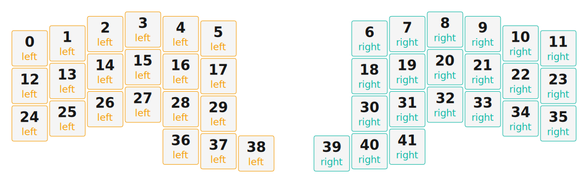

# ZMK Configuration for zmk2

*Generated by Shield Wizard for ZMK*



Download compiled firmware from the Actions tab. <https://zmk.dev/docs/user-setup#installing-the-firmware>

Edit your keymap <https://zmk.dev/docs/keymaps>.
User keymap is located at [`config/zmk2.keymap`](config/zmk2.keymap).

-----

<details>
<summary>
Shield Wizard Debug Information
</summary>

In case of broken configuration, here is the Shield Wizard internal data used to generate this configuration:

Commit: 8a52249f61161469b6d90ed8c80c4aa52b9f3858

```json
{"name":"zmk2","shield":"zmk2","dongle":false,"modules":[],"layout":[{"id":"01KJ369615A56BYY0E0WRNR864","part":0,"row":0,"col":0,"w":1,"h":1,"x":0,"y":0.5,"r":0,"rx":0,"ry":0},{"id":"01KJ369615VMW51XNXHS652VZ8","part":0,"row":0,"col":1,"w":1,"h":1,"x":1,"y":0.37,"r":0,"rx":0,"ry":0},{"id":"01KJ369615R4WXPGCKKGVSR4NV","part":0,"row":0,"col":2,"w":1,"h":1,"x":2,"y":0.12,"r":0,"rx":0,"ry":0},{"id":"01KJ3696156MN56JW91T9ASN89","part":0,"row":0,"col":3,"w":1,"h":1,"x":3,"y":0,"r":0,"rx":0,"ry":0},{"id":"01KJ369615CDKJWJB2GJ60HPMV","part":0,"row":0,"col":4,"w":1,"h":1,"x":4,"y":0.12,"r":0,"rx":0,"ry":0},{"id":"01KJ369615R5EX6SP7EDQE3DM4","part":0,"row":0,"col":5,"w":1,"h":1,"x":5,"y":0.24,"r":0,"rx":0,"ry":0},{"id":"01KJ369615W7XANFT0PY7PXFHN","part":1,"row":0,"col":6,"w":1,"h":1,"x":9,"y":0.24,"r":0,"rx":0,"ry":0},{"id":"01KJ369615H2H94T8YQD19RHHB","part":1,"row":0,"col":7,"w":1,"h":1,"x":10,"y":0.12,"r":0,"rx":0,"ry":0},{"id":"01KJ3696153ZVGCDKCN3TN4XYV","part":1,"row":0,"col":8,"w":1,"h":1,"x":11,"y":0,"r":0,"rx":0,"ry":0},{"id":"01KJ369615GXCH11EJD0ESH10X","part":1,"row":0,"col":9,"w":1,"h":1,"x":12,"y":0.12,"r":0,"rx":0,"ry":0},{"id":"01KJ369615NM79S7DNTX7Z3TRC","part":1,"row":0,"col":10,"w":1,"h":1,"x":13,"y":0.37,"r":0,"rx":0,"ry":0},{"id":"01KJ3696151GK6CKTR0HJESW4V","part":1,"row":0,"col":11,"w":1,"h":1,"x":14,"y":0.5,"r":0,"rx":0,"ry":0},{"id":"01KJ369615687T08EC4H8ME785","part":0,"row":1,"col":0,"w":1,"h":1,"x":0,"y":1.5,"r":0,"rx":0,"ry":0},{"id":"01KJ369615KH14PFSETN1ZBF60","part":0,"row":1,"col":1,"w":1,"h":1,"x":1,"y":1.37,"r":0,"rx":0,"ry":0},{"id":"01KJ369615AR5NF1C6J5Y0TJ5D","part":0,"row":1,"col":2,"w":1,"h":1,"x":2,"y":1.12,"r":0,"rx":0,"ry":0},{"id":"01KJ369615QD5ZDJB4FWK2ZCGW","part":0,"row":1,"col":3,"w":1,"h":1,"x":3,"y":1,"r":0,"rx":0,"ry":0},{"id":"01KJ369615PFGT69R2V61109YN","part":0,"row":1,"col":4,"w":1,"h":1,"x":4,"y":1.12,"r":0,"rx":0,"ry":0},{"id":"01KJ369615MF7QHGANHPSG6P2H","part":0,"row":1,"col":5,"w":1,"h":1,"x":5,"y":1.24,"r":0,"rx":0,"ry":0},{"id":"01KJ369615ZK51H1EB8KGM04SF","part":1,"row":1,"col":6,"w":1,"h":1,"x":9,"y":1.24,"r":0,"rx":0,"ry":0},{"id":"01KJ369615Y5MQ8H4HYJ4BFQFJ","part":1,"row":1,"col":7,"w":1,"h":1,"x":10,"y":1.12,"r":0,"rx":0,"ry":0},{"id":"01KJ369615HQRMYV1WHEEK2Z3E","part":1,"row":1,"col":8,"w":1,"h":1,"x":11,"y":1,"r":0,"rx":0,"ry":0},{"id":"01KJ369616EZ057DGB0SG2NSFP","part":1,"row":1,"col":9,"w":1,"h":1,"x":12,"y":1.12,"r":0,"rx":0,"ry":0},{"id":"01KJ369616NA33RKXMJ96YPBFJ","part":1,"row":1,"col":10,"w":1,"h":1,"x":13,"y":1.37,"r":0,"rx":0,"ry":0},{"id":"01KJ369616T7MAASFS8QCNF2QR","part":1,"row":1,"col":11,"w":1,"h":1,"x":14,"y":1.5,"r":0,"rx":0,"ry":0},{"id":"01KJ369616VWDY2G4HS8HFG7WM","part":0,"row":2,"col":0,"w":1,"h":1,"x":0,"y":2.5,"r":0,"rx":0,"ry":0},{"id":"01KJ369616K5J5S3WBDN19GEAQ","part":0,"row":2,"col":1,"w":1,"h":1,"x":1,"y":2.37,"r":0,"rx":0,"ry":0},{"id":"01KJ369616JNM3F5SRNSVJ711V","part":0,"row":2,"col":2,"w":1,"h":1,"x":2,"y":2.12,"r":0,"rx":0,"ry":0},{"id":"01KJ369616FQ552Y7GVR579QTR","part":0,"row":2,"col":3,"w":1,"h":1,"x":3,"y":2,"r":0,"rx":0,"ry":0},{"id":"01KJ36961681650NRVD63VBDP0","part":0,"row":2,"col":4,"w":1,"h":1,"x":4,"y":2.12,"r":0,"rx":0,"ry":0},{"id":"01KJ369616NNHK8RPAD97Q2X4G","part":0,"row":2,"col":5,"w":1,"h":1,"x":5,"y":2.24,"r":0,"rx":0,"ry":0},{"id":"01KJ3696163RJFHTZ72MTGE889","part":1,"row":2,"col":6,"w":1,"h":1,"x":9,"y":2.24,"r":0,"rx":0,"ry":0},{"id":"01KJ369616B7DJMVJ36C8Y1KQ6","part":1,"row":2,"col":7,"w":1,"h":1,"x":10,"y":2.12,"r":0,"rx":0,"ry":0},{"id":"01KJ369616HJSJD69G89MHDE8A","part":1,"row":2,"col":8,"w":1,"h":1,"x":11,"y":2,"r":0,"rx":0,"ry":0},{"id":"01KJ369616F7PK17Z0T7R94621","part":1,"row":2,"col":9,"w":1,"h":1,"x":12,"y":2.12,"r":0,"rx":0,"ry":0},{"id":"01KJ369616YPPV2MWP1W0JX7T2","part":1,"row":2,"col":10,"w":1,"h":1,"x":13,"y":2.37,"r":0,"rx":0,"ry":0},{"id":"01KJ369616GV47VFK8M5E23PWE","part":1,"row":2,"col":11,"w":1,"h":1,"x":14,"y":2.5,"r":0,"rx":0,"ry":0},{"id":"01KJ369616MT7V5GY82PD667DQ","part":0,"row":3,"col":3,"w":1,"h":1,"x":4,"y":3.12,"r":0,"rx":0,"ry":0},{"id":"01KJ369616HSN50VMT13CYFJRF","part":0,"row":3,"col":4,"w":1,"h":1,"x":5,"y":3.24,"r":0,"rx":4.5,"ry":4.12},{"id":"01KJ369616YFZPFXTW90NXTMXH","part":0,"row":3,"col":5,"w":1,"h":1,"x":6,"y":3.3,"r":0,"rx":5.48,"ry":4.33},{"id":"01KJ369616KGQK6SR28N2E16T6","part":1,"row":3,"col":6,"w":1,"h":1,"x":8,"y":3.3,"r":0,"rx":8.52,"ry":4.33},{"id":"01KJ369616S7GZ6VEK0TZ99P3J","part":1,"row":3,"col":7,"w":1,"h":1,"x":9,"y":3.24,"r":0,"rx":9.5,"ry":4.12},{"id":"01KJ369616PV0YNVRNJA4B71N5","part":1,"row":3,"col":8,"w":1,"h":1,"x":10,"y":3.12,"r":0,"rx":0,"ry":0}],"parts":[{"name":"left","controller":"nice_nano_v2","wiring":"matrix_diode","pins":{"d2":"output","d3":"output","d4":"output","d5":"output","d6":"input","d7":"input","d8":"input","d9":"input","d21":"input","d20":"input","d19":"input"},"keys":{"01KJ369615A56BYY0E0WRNR864":{"input":"d6","output":"d2"},"01KJ369615VMW51XNXHS652VZ8":{"input":"d7","output":"d2"},"01KJ369615R4WXPGCKKGVSR4NV":{"input":"d8","output":"d2"},"01KJ3696156MN56JW91T9ASN89":{"input":"d9","output":"d2"},"01KJ369615CDKJWJB2GJ60HPMV":{"input":"d21","output":"d2"},"01KJ369615R5EX6SP7EDQE3DM4":{"input":"d20","output":"d2"},"01KJ369615687T08EC4H8ME785":{"input":"d6","output":"d3"},"01KJ369615KH14PFSETN1ZBF60":{"input":"d7","output":"d3"},"01KJ369615AR5NF1C6J5Y0TJ5D":{"input":"d8","output":"d3"},"01KJ369615PFGT69R2V61109YN":{"input":"d21","output":"d3"},"01KJ369615QD5ZDJB4FWK2ZCGW":{"input":"d9","output":"d3"},"01KJ369615MF7QHGANHPSG6P2H":{"input":"d20","output":"d3"},"01KJ369616VWDY2G4HS8HFG7WM":{"input":"d6","output":"d4"},"01KJ369616K5J5S3WBDN19GEAQ":{"input":"d7","output":"d4"},"01KJ369616JNM3F5SRNSVJ711V":{"input":"d8","output":"d4"},"01KJ369616FQ552Y7GVR579QTR":{"input":"d9","output":"d4"},"01KJ36961681650NRVD63VBDP0":{"input":"d21","output":"d4"},"01KJ369616NNHK8RPAD97Q2X4G":{"input":"d20","output":"d4"},"01KJ369616MT7V5GY82PD667DQ":{"input":"d21","output":"d5"},"01KJ369616HSN50VMT13CYFJRF":{"input":"d20","output":"d5"},"01KJ369616YFZPFXTW90NXTMXH":{"input":"d19","output":"d5"}},"encoders":[],"buses":[{"name":"spi0","devices":[],"type":"spi"},{"name":"spi1","devices":[],"type":"spi"},{"name":"spi2","devices":[],"type":"spi"},{"name":"spi3","devices":[],"type":"spi"},{"name":"i2c0","devices":[],"type":"i2c"},{"name":"i2c1","devices":[],"type":"i2c"}]},{"name":"right","controller":"nice_nano_v2","wiring":"matrix_diode","pins":{"d2":"output","d3":"output","d4":"output","d5":"output","d6":"input","d7":"input","d8":"input","d9":"input","d21":"input","d20":"input","d19":"input"},"keys":{"01KJ369615W7XANFT0PY7PXFHN":{"input":"d20","output":"d2"},"01KJ369615H2H94T8YQD19RHHB":{"input":"d21","output":"d2"},"01KJ3696153ZVGCDKCN3TN4XYV":{"input":"d9","output":"d2"},"01KJ369615GXCH11EJD0ESH10X":{"input":"d8","output":"d2"},"01KJ369615NM79S7DNTX7Z3TRC":{"input":"d7","output":"d2"},"01KJ3696151GK6CKTR0HJESW4V":{"input":"d6","output":"d2"},"01KJ369615ZK51H1EB8KGM04SF":{"input":"d20","output":"d3"},"01KJ369615Y5MQ8H4HYJ4BFQFJ":{"input":"d21","output":"d3"},"01KJ369615HQRMYV1WHEEK2Z3E":{"input":"d9","output":"d3"},"01KJ369616EZ057DGB0SG2NSFP":{"input":"d8","output":"d3"},"01KJ369616NA33RKXMJ96YPBFJ":{"input":"d7","output":"d3"},"01KJ369616T7MAASFS8QCNF2QR":{"input":"d6","output":"d3"},"01KJ3696163RJFHTZ72MTGE889":{"input":"d20","output":"d4"},"01KJ369616B7DJMVJ36C8Y1KQ6":{"input":"d21","output":"d4"},"01KJ369616HJSJD69G89MHDE8A":{"input":"d9","output":"d4"},"01KJ369616F7PK17Z0T7R94621":{"input":"d8","output":"d4"},"01KJ369616YPPV2MWP1W0JX7T2":{"input":"d7","output":"d4"},"01KJ369616GV47VFK8M5E23PWE":{"input":"d6","output":"d4"},"01KJ369616KGQK6SR28N2E16T6":{"input":"d19","output":"d5"},"01KJ369616S7GZ6VEK0TZ99P3J":{"input":"d20","output":"d5"},"01KJ369616PV0YNVRNJA4B71N5":{"input":"d21","output":"d5"}},"encoders":[],"buses":[{"name":"spi0","devices":[],"type":"spi"},{"name":"spi1","devices":[],"type":"spi"},{"name":"spi2","devices":[],"type":"spi"},{"name":"spi3","devices":[],"type":"spi"},{"name":"i2c0","devices":[],"type":"i2c"},{"name":"i2c1","devices":[],"type":"i2c"}]}]}
```

</details>
